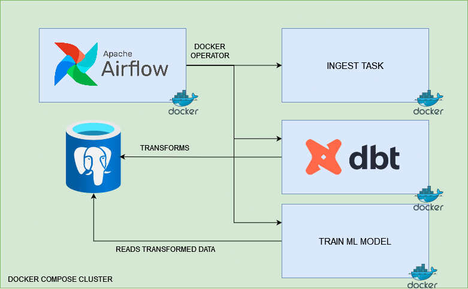
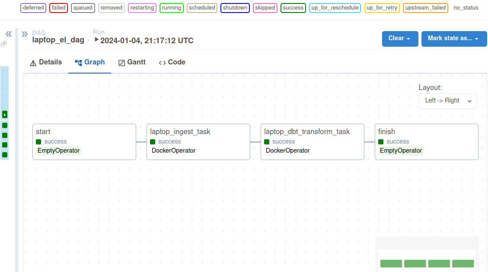
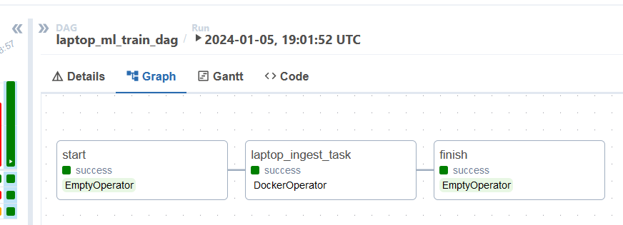

# ML Pipeline with Docker, Airflow, DBT, postgres and Pytorch

## Project Overview 📌
The airflow setup contains 2 dags, one for the ELT (Extract, Load, Transform) process and one for the ML pipeline.

🔍 The ELT dag fetches laptops tabular data from the Kaggle API, loads it into the DataWarehouse, and then transforms it via DBT. The ML dag then trains a Pytorch model on the transformed data and saves the model to a file.

## System Architecture 🏗️

## Made With 🛠️

- Python
- Docker
- Airflow
- DBT
- Postgres
- Pytorch
- Bash

## Dags

